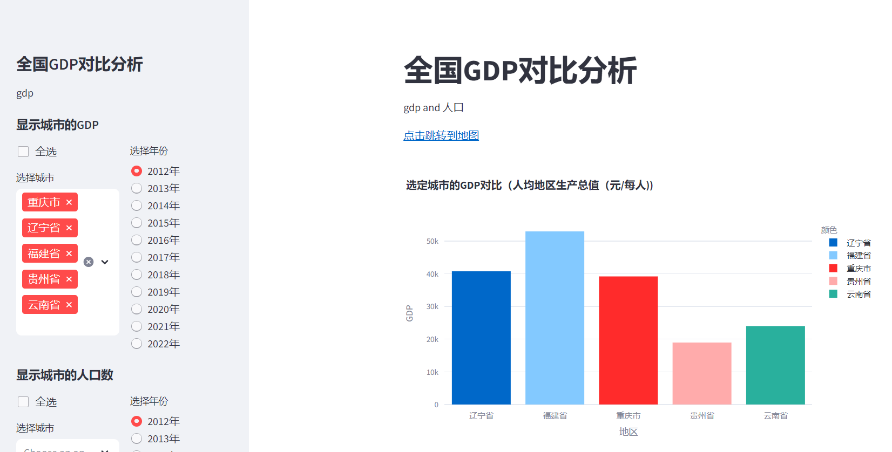
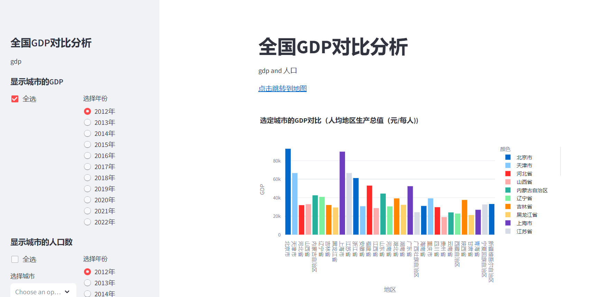
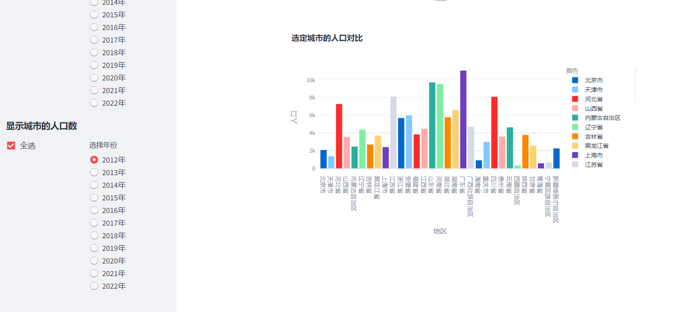
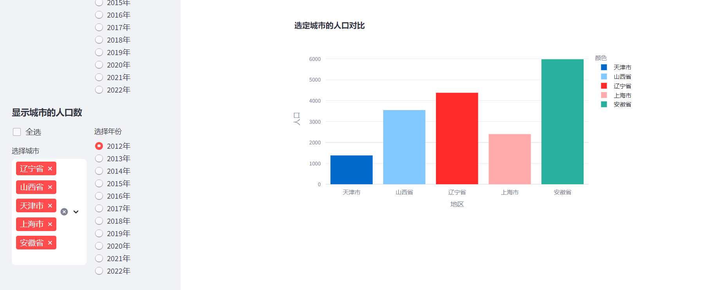
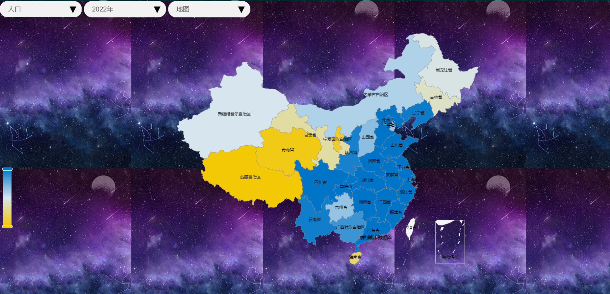

# 运用全国GDP数据及其衍生数据来展示多年国家经济变化区势
通过streamlit框架在本地建立一个web，通过对各种数据的可视化图表来形象展示全国各地区整体的经济发展趋势。目前只是完成了部分基础内容的构建，
之后会逐渐丰富web页面的内容，通过此仪表盘可以具体到对几个城市之间的比较，可以给用户提供数据、城市、年份、等全方面的可视化展示，用户可以自
的选择组合。

### 步骤:-
1. 建设基础框架，基础图表
2. 运用echarts绘制，更加复杂化的图像
3. 总体展示结合，丰富web内容。

### 仪表盘页面展示

